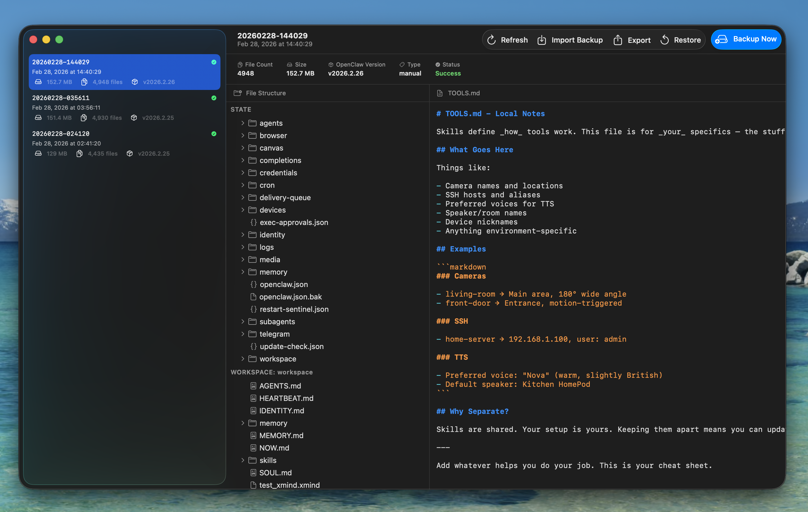

# BackClaw

A simple, safe, and traceable local backup & restore tool for [OpenClaw](https://github.com/openclaw/openclaw) — built natively for macOS with Swift and SwiftUI.



## Features

- **Manual Backup** — Select your OpenClaw directory and create a timestamped archive instantly.
- **Scheduled Backup** — Configure hourly, daily, or weekly automatic backups with custom retention policies.
- **Archive Preview** — Browse the file tree of any backup and preview text-based config files (read-only).
- **One-Click Restore** — Restore any archive with a double-confirmation step to prevent accidental overwrites.
- **Export to Archive** — Export any backup as `.tar.gz` or `.zip` for offline storage.
- **OpenClaw Scheduler Config** — Automatically detects and includes OpenClaw scheduled task configurations in every backup, with structured preview and selective restore support.

## Requirements

- macOS 14.0 (Sonoma) or later

## Installation

### Homebrew (recommended)

```bash
brew tap Geoion/tap
brew install --cask backclaw
```

### Manual

Download the latest `.dmg` from the [Releases](https://github.com/Geoion/BackClaw/releases) page, open it, and drag **BackClaw.app** to your Applications folder.

Since BackClaw is not notarized yet, macOS Gatekeeper may block the first launch. Run the following command to clear the quarantine attribute:

```bash
xattr -cr /Applications/BackClaw.app
```

Then open the app normally.

## Build from Source

```bash
git clone https://github.com/Geoion/BackClaw.git
cd BackClaw
xcodebuild -scheme BackClaw -configuration Release
```

Requires Xcode 16 and Swift 6.

## Backup Structure

Each archive is stored as:

```
Backups/
└── <archive-id>/
    ├── meta.json
    └── payload/
        ├── state/           # OpenClaw state directory (~/.openclaw/)
        └── workspaces/
            └── <name>/      # Per-agent workspace directories
```

`meta.json` records the archive ID, source paths, file count, size, timestamps, OpenClaw version, and scheduler config metadata.

## Roadmap

**V1**
- [x] Manual backup and restore
- [x] Scheduled backup with retention policies
- [x] Archive preview (file tree + text config)
- [x] Export as tar.gz / zip
- [x] OpenClaw scheduler config backup & restore

**Planned**
- [ ] Incremental backup
- [ ] SHA-256 integrity verification
- [ ] Archive tagging and global search
- [ ] File-level diff view
- [ ] Encrypted export (AES-256)
- [ ] Cloud archiving (S3 / WebDAV / SMB)

## License

[MIT](LICENSE)
